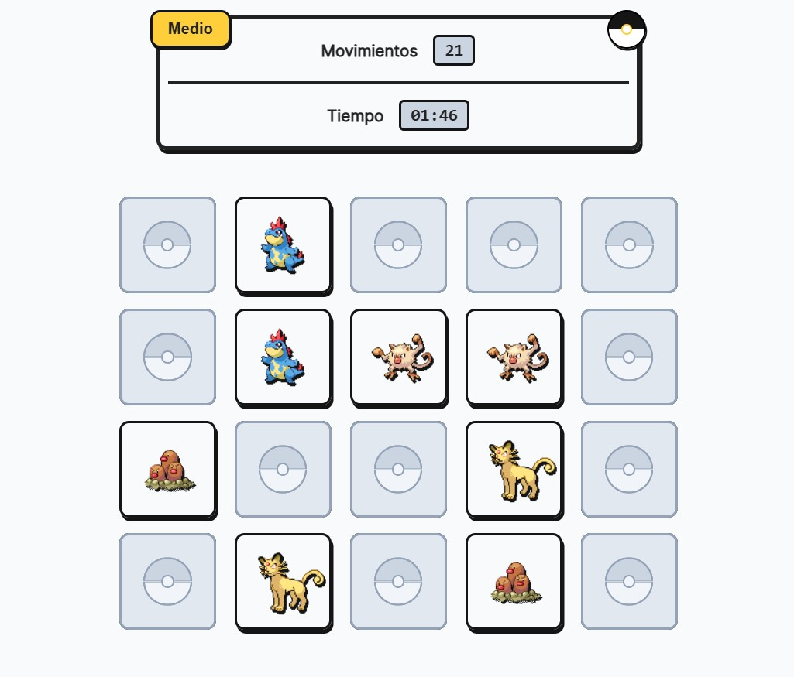

# Poke Memory

Videojuego web del clásico juego de memoria por parejas con imágenes de la [Poke API](https://pokeapi.co/).

## Tecnologías usadas
### Frameworks y librerías

- [React](https://reactjs.org/)
- [Framer Motion](https://www.framer.com/motion/)
- [Vanilla-Extract](https://vanilla-extract.style/)

### Servicios

- [Poke API](https://pokeapi.co/)

### Fuentes

- [Inter](https://fonts.google.com/specimen/Inter?query=inter)

## Getting started

1. `git clone https://github.com/HDMC3/memory-game.git`
2. `cd memory-game`
3. `npm install`
4. `npm run dev`
